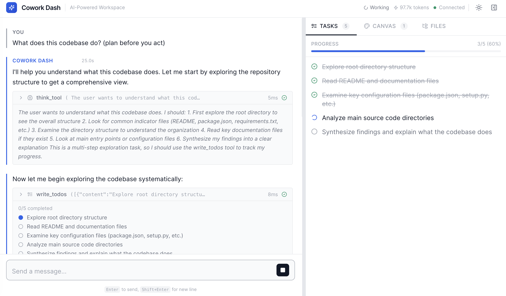

# LangStage

**Every stage for your LangGraph agent.**

Write your agent once — any LangGraph `CompiledGraph`, from a single ReAct agent
to a **multi-agent supervisor** — and run it on every surface with the *same*
spec string, the *same* `langstage.toml` config, and the *same* `LANGSTAGE_*`
environment variables. The web, your terminal, JupyterLab, and VS Code all
become stages your agent can perform on.

<figure markdown="span">
  { width="760" }
  <figcaption>Your agent on the web stage — streaming, tool calls, a file browser, and a canvas.</figcaption>
</figure>

<!-- TODO(demo): embed the animated family overview here (one agent spec running on the web, terminal, JupyterLab and VS Code). -->

!!! tip "Multi-agent? It already works."
    A supervisor, swarm, or crew compiles to the same `CompiledStateGraph`
    LangStage loads — so multi-agent routing and hand-offs run and stream exactly
    like a single agent, with no extra setup. See
    [Running a multi-agent supervisor](guides/multi-agent-supervisor.md).

## 30-second quickstart

No agent or API key yet? See a stage working with the built-in keyless demo
agent:

```bash
pip install langstage
langstage run --demo
```

Then point it at *your* agent — a Python file (or module) that exports a
LangGraph `CompiledGraph`:

```bash
langstage run --agent my_agent.py:graph
```

That same `my_agent.py:graph` spec runs unchanged on every other stage below.

## The family

| Stage | Package | Try it |
|---|---|---|
| :material-web: Web app | [`langstage`](stages/web.md) | `langstage run --agent my_agent.py:graph` |
| :material-console: Terminal | [`langstage-cli`](stages/cli.md) | `langstage-cli -a my_agent.py:graph` |
| :material-notebook: JupyterLab | [`langstage-jupyter`](stages/jupyter.md) | `langstage-jupyter -a my_agent.py:graph`, then the chat sidebar |
| :material-microsoft-visual-studio-code: VS Code | [`langstage-vscode`](stages/vscode.md) | `@langstage` in the chat panel (sidecar from PyPI + the CI-built `.vsix`) |
| :material-robot: Reference agent | [`langstage-hermes`](stages/hermes.md) | `langstage-hermes demo`, or `-a langstage_hermes.agent:graph` on any stage |
| :material-cog: Shared core | [`langstage-core`](core.md) | spec loading, layered config, the AG-UI bridge and the task engine behind every stage; `langstage-agui` serves any agent over AG-UI |

## Why LangStage

- **Write once, run anywhere.** A single `module:attr` / `path/to/file.py:attr`
  spec string is understood identically by every stage.
- **Keyless demos everywhere.** Every surface has a deterministic, keyless demo
  (`--demo` on most; `langstage-hermes demo`), and a tool demo
  (`langstage_core.demo.tools:graph`, or `--demo=tools`) shows tool calls, reasoning
  and an approval prompt without an API key.
- **One config story.** `defaults < ~/.langstage/config.toml < langstage.toml <
  LANGSTAGE_* env < flags`. Inspect the resolved values anywhere with
  `--show-config`, and gate CI on them with `langstage config --strict`.
- **Preflights and scripts.** Every surface can check an agent in one command
  (`--verify`, `check --live`, `--selfcheck`), run one turn and print the reply,
  and uses the same [exit codes](reference/exit-codes.md): `0` ok, `1` failed, `2`
  paused for a human, `64` usage error.
- **Human-in-the-loop on every stage.** One set of
  [decision verbs](guides/human-in-the-loop.md) (`approve`, `edit`, `reject`,
  `respond`), with approval buttons in the web app, JupyterLab and VS Code, and a
  menu in the terminal.
- **Built on the standard.** Pure [LangGraph](https://github.com/langchain-ai/langgraph);
  every surface streams through the official
  [AG-UI](https://github.com/ag-ui-protocol/ag-ui) adapter, and the same
  [frames](reference/frames.md) are available to your own code.

!!! tip "Coming from `deepagent-*` or `cowork-dash`?"
    Every package was renamed into the LangStage family. Your old `pip install`s,
    imports, and commands still work — see [Migrating](migrating.md).

Start with [Installation](getting-started/installation.md) →
