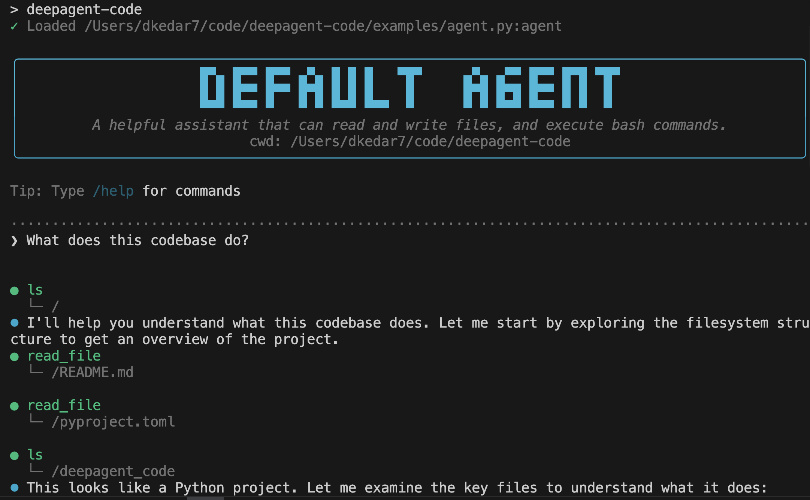

# Terminal — `langstage-cli`

The terminal stage: a Claude Code-style CLI that runs *any* LangGraph
`CompiledGraph` from the command line, with streaming, tool-call rendering, and
human-in-the-loop approval. It runs *your* agent — it isn't a bundled
coding agent.

[:material-github: dkedar7/langstage-cli](https://github.com/dkedar7/langstage-cli){ .md-button }
[:material-package: PyPI](https://pypi.org/project/langstage-cli/){ .md-button }

## Quickstart

```bash
pip install langstage-cli

langstage-cli --demo "hello"                 # keyless echo agent
langstage-cli -a my_agent.py:graph           # your agent (interactive)
langstage-cli -a my_agent.py:graph "What can you do?"
langstage-cli -f ./prompt.md                 # read the message from a file
langstage-cli --show-config                  # resolved config + sources
```

<figure markdown="span">
  { width="720" }
</figure>

## Common flags

| Flag | Purpose |
|---|---|
| `-a`, `--agent` | Agent spec (`path/to/file.py:graph` or `module:graph`) |
| `--demo` | Run the built-in keyless echo agent |
| `-f`, `--file` | Read the input message from a file |
| `--no-interactive` | Auto-approve tool calls (scripting) |
| `-v`, `--verbose` | Show node names and extra detail |
| `--show-config` | Print resolved configuration and exit |

In the interactive loop, `/q` quits, `/c` clears history, `/h` shows help.

## Programmatic use

```python
from langstage_cli import stream_graph_updates, prepare_agent_input

for chunk in stream_graph_updates(graph, prepare_agent_input(message="Hello!")):
    if chunk.get("chunk"):
        print(chunk["chunk"], end="")
```
