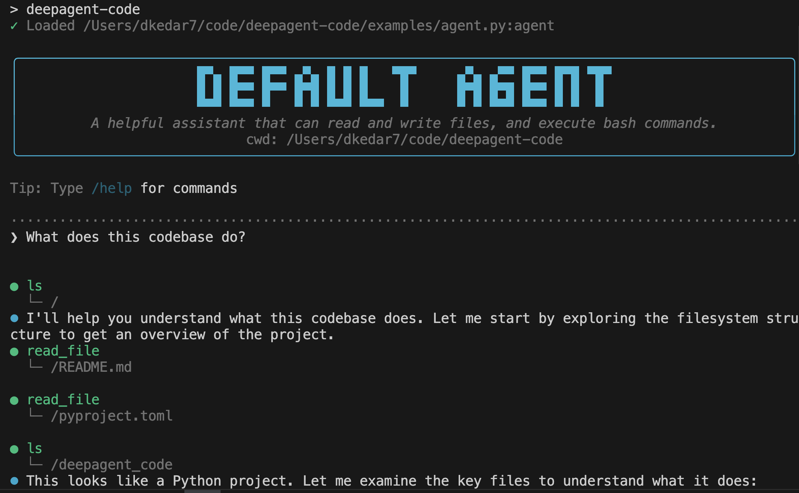

# Terminal — `langstage-cli`

The terminal stage: a Claude Code-style CLI that runs *any* LangGraph
`CompiledGraph` from the command line, with streaming, tool-call rendering,
human-in-the-loop approval, and sessions you can pick up later. It runs *your*
agent; it isn't a bundled coding agent.

[:material-github: dkedar7/langstage-cli](https://github.com/dkedar7/langstage-cli){ .md-button }
[:material-package: PyPI](https://pypi.org/project/langstage-cli/){ .md-button }

## Quickstart

```bash
pip install langstage-cli

langstage-cli --demo "hello"                                   # keyless echo agent
langstage-cli -a langstage_core.demo.tools:graph "use a tool"  # keyless tools / reasoning / HITL demo
langstage-cli init                                             # scaffold my_agent.py + langstage.toml
langstage-cli "hi"                                             # runs the scaffolded agent, no -a needed
langstage-cli -a my_agent.py:graph                             # your agent, interactive
langstage-cli -a my_agent.py:graph "What can you do?"          # one message, then exit
langstage-cli -f ./prompt.md                                   # read the message from a file
```

`init` writes a minimal agent that needs only `langgraph` (already installed) and a
`langstage.toml` pointing at it. It won't overwrite either file unless you pass
`--force`.

<figure markdown="span">
  { width="720" }
</figure>

## Demo

<!-- TODO(demo): embed the animated terminal demo here (streaming reply, a tool call, the approval menu, `-c` resuming a session). -->

## Options

| Flag | Purpose |
|---|---|
| `-a`, `--agent SPEC` | Agent spec (`path/to/file.py:graph` or `module:graph`). |
| `-g`, `--graph-name NAME` | Graph variable name when the spec has no `:name` (default `graph`). |
| `--demo` | Run the built-in keyless echo agent. |
| `-f`, `--file PATH` | Read the message from a file. |
| `-q`, `--quiet` | Print only the reply (automatic when stdout is piped). |
| `--interactive/--no-interactive` | Ask before approving an interrupt (default), or auto-approve. |
| `-v`, `--verbose` | Show node names, and the full traceback when a load or a turn fails. |
| `-c`, `--continue` | Resume the most recent session for this workspace. |
| `--resume [ID]` | Resume a specific session; bare `--resume` lists them. |
| `--list-sessions` | List resumable sessions and exit. |
| `--persist/--no-persist` | Save this session so it can be resumed (default on). |
| `--verify` | Run one real turn and exit `0` if it completed, non-zero otherwise. |
| `--show-config` | Print the resolved configuration and exit. |
| `--version` | Print the version. |
| `init [--force]` | Scaffold `my_agent.py` and `langstage.toml`. |

A spec's inline `:name` (`app.py:prod`) wins over `-g` / `[agent] graph_name`.
`--show-config` reports the graph that actually runs.

## Interactive commands

In the interactive loop:

| Command | What it does |
|---|---|
| `/help` (`/h`, `/?`) | Help, or `/help <command>` |
| `/status` (`/s`) | Agent, thread, verbose mode, working directory |
| `/version` (`/v`) | Version and the current agent |
| `/config` (`/cfg`) | Show the resolved config, or set a runtime key: `/config [key] [value]` |
| `/verbose [on/off]` | Toggle or set verbose output |
| `/history [N]` (`/hist`) | Recent conversation messages |
| `/clear` (`/c`) | Clear the history and start a fresh thread |
| `/reset` (`/restart`) | Reset the session (history and thread) |
| `/quit` (`/q`, `/exit`) | Exit |

**Tab** completes commands, and **Ctrl+C** exits.

## Sessions

Every run saves its conversation, so a later run can continue it, the way Claude
Code or Aider do. You don't need a checkpointer in your graph.

```bash
langstage-cli --demo "remember: my name is Kedar"   # a new session, saved
langstage-cli --demo -c "what's my name?"           # continue the most recent session
langstage-cli --list-sessions                       # sessions for this workspace
langstage-cli --resume 3f2a                         # a specific one (an unambiguous prefix works)
```

- Sessions are stored per workspace in `~/.langstage/sessions/<workspace-hash>.sqlite`
  (under `LANGSTAGE_CONFIG_HOME` if set; `LANGSTAGE_CLI_SESSIONS_DIR` moves them).
- Turn persistence off with `--no-persist`, `LANGSTAGE_PERSIST=0`, or
  `[session] persist = false` in `langstage.toml`.
- `--no-persist -c` resumes **read-only**: the run sees the earlier conversation but
  saves nothing.
- A graph that compiles in its **own** checkpointer keeps it, and the CLI's store
  isn't used. `/config`, `/status` and `--list-sessions` say so. An in-memory
  `MemorySaver` gets a note on stderr, since nothing it holds survives the run.
- `/clear` and `/reset` start a new thread, which becomes its own session.

## Scripting

A single-shot run (a `MESSAGE` argument, `-f`, or piped stdin) prints only the
agent's reply when stdout is piped: no header, spinner, tool chatter, timing or
color. Errors and diagnostics go to stderr, as does anything your agent `print`s
while it is imported. The exit code tells you whether the turn worked
(see [Exit codes](../reference/exit-codes.md)).

```bash
answer=$(langstage-cli --demo "say hi") || echo "run failed" >&2
echo "$answer"                        # (demo agent) You said: say hi

cat prompt.txt | langstage-cli --demo # all of stdin is ONE message
```

- Piped stdin is sent as a single message, like `-f`. Lines starting with `/` are
  part of the message, not commands.
- An empty `MESSAGE` or empty stdin is an error, not a silent no-op.
- A terminal still gets the interactive REPL (on Windows, that includes mintty /
  Git Bash).
- `-q` forces the same clean output in a terminal.
- An interrupt needs a person: with stdin not a terminal, the CLI stops rather
  than approve blind, and exits `2` ("paused"). `--no-interactive` auto-approves on
  purpose.

Gate CI on an agent with `--verify`:

```bash
langstage-cli --verify -a my_agent.py:graph || { echo "agent broken" >&2; exit 1; }
```

## Rendering

- **Markdown.** Replies render bold, italics, inline code, links, and fenced code
  blocks. Styling is applied per line as the reply streams, so a `**bold**` span
  split across tokens still renders, and code spans and `* bullets` are left alone.
- **Messages and tools.** Each assistant message starts its own block, a message's
  text prints before its own tool calls, and tool results never run into an open
  line of text.
- **Approvals** list every argument of the action as `name=value`, with control
  characters escaped so a tool argument can't fake prompt text. See
  [Human-in-the-loop](../guides/human-in-the-loop.md).
- **Graphs without `messages`.** A graph whose state has no `messages` channel
  (say `{"query", "answer"}`) still runs: the CLI prints its final state as JSON,
  with a note on stderr. A turn with nothing to show is an error.

## Configuration

`langstage-cli` reads the global `~/.langstage/config.toml` and the nearest project
`langstage.toml`, then `LANGSTAGE_*` env vars, then flags. See
[Configuration](../getting-started/configuration.md).

```toml title="langstage.toml"
[agent]
spec = "my_agent.py:graph"   # relative to this file

[workspace]
root = "."

[ui]
verbose = true

[session]
persist = true

[configurable]               # seeds RunnableConfig["configurable"]
thread_id = "my-thread"      # a pinned thread persists across runs
```

## Programmatic use

The CLI streams through the core's chunk wire. To do the same in your own code:

```python
import asyncio
from langstage_core import load_agent_spec
from langstage_core.agui import build_agent, iter_chunk_frames

agent = build_agent(load_agent_spec("langstage_core.demo.stub:graph"))   # or "my_agent.py:graph"

async def main():
    async for chunk in iter_chunk_frames(agent, "Hello!", thread_id="s1"):
        if chunk.get("chunk"):
            print(chunk["chunk"], end="")
    print()

asyncio.run(main())
```

A `streaming` chunk carries exactly one payload key (`chunk`, `reasoning`,
`tool_calls`, `tool_result` or `extraction`). See the
[frame reference](../reference/frames.md).
