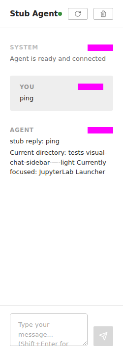
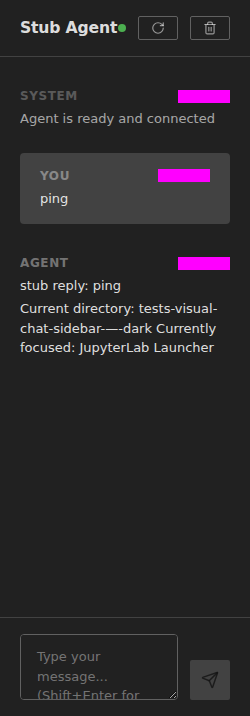

# JupyterLab — `langstage-jupyter`

The JupyterLab stage: a chat sidebar that gives your LangGraph agent access to
notebooks and files, for natural-language data-science work without leaving the
lab.

[:material-github: dkedar7/langstage-jupyter](https://github.com/dkedar7/langstage-jupyter){ .md-button }
[:material-package: PyPI](https://pypi.org/project/langstage-jupyter/){ .md-button }

## Quickstart

```bash
pip install langstage-jupyter

# Instead of `jupyter lab`, use the launcher (auto-configures the server):
langstage-jupyter                            # default agent (needs ANTHROPIC_API_KEY)
langstage-jupyter --demo                      # keyless echo agent
langstage-jupyter -a my_agent.py:graph        # your agent
langstage-jupyter --show-config               # resolved config + sources
```

The launcher auto-detects a port, generates an auth token, sets the required
environment, and starts JupyterLab with the chat sidebar wired up.

<figure markdown="span">
  { width="360" }
  { width="360" }
  <figcaption>The chat sidebar, light and dark — it follows JupyterLab's own theme.</figcaption>
</figure>

## Highlights

- **Notebook tools** — create, edit, and execute cells from chat.
- **Context-aware** — sends the focused widget, current directory, and
  selection to your agent.
- **Human-in-the-loop** review of agent actions.
- Uses the same agent spec and config as every other stage; pick the agent with
  `-a`/`--agent` or `LANGSTAGE_AGENT_SPEC`.

!!! note "Screenshots show small timestamp masks"
    The sidebar images above come from the visual-regression baselines, which
    mask volatile timestamps. Functionally representative; cleaner marketing
    shots are a planned follow-up.
