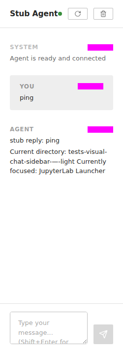
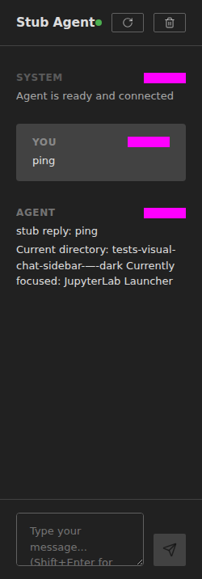

# JupyterLab — `langstage-jupyter`

The JupyterLab stage: a chat sidebar that gives your LangGraph agent access to
notebooks and files, for natural-language data-science work without leaving the
lab.

[:material-github: dkedar7/langstage-jupyter](https://github.com/dkedar7/langstage-jupyter){ .md-button }
[:material-package: PyPI](https://pypi.org/project/langstage-jupyter/){ .md-button }

## Quickstart

Instead of `jupyter lab`, use the launcher. It picks a free port, generates an auth
token, sets the environment the sidebar needs, and starts JupyterLab:

<!-- snippet: run server needs=my_agent.py -->
```bash
pip install langstage-jupyter

langstage-jupyter --demo                      # keyless echo agent
langstage-jupyter -a my_agent.py:graph        # your agent
langstage-jupyter                             # the default agent (needs ANTHROPIC_API_KEY)
```

<figure markdown="span">
  { width="360" }
  { width="360" }
  <figcaption>The chat sidebar, light and dark. It follows JupyterLab's own theme.</figcaption>
</figure>

## Demo

<!-- TODO(demo): embed the animated JupyterLab demo here (the agent creating and running a notebook cell, the open tab reloading). -->

## Launcher options

| Option | What it does |
|---|---|
| `-a`, `--agent SPEC` | The agent to load. |
| `--demo` | The built-in keyless echo agent. |
| `--show-config [--json]` | Print the resolved config and exit. |
| `--verify` | Load the agent and run one real turn; exit `0`/`1`. |
| `--ask "PROMPT"` | Run one turn, print the reply, exit (`0` complete, `1` error, `2` interrupted). No browser, no server. |
| `--serve-check` | Boot the server extension headless and serve one turn over HTTP; exit `0`/`1`. |
| `--check-connection` | For manual setups: check that `LANGSTAGE_JUPYTER_SERVER_URL` and `LANGSTAGE_JUPYTER_TOKEN` reach a running Jupyter; exit `0`/`1`. |
| `--version` | Print the version. |

Every other option is passed through to `jupyter lab` (`--no-browser`, `--port 8889`,
`--ServerApp.root_dir=…`).

- `--ask` takes its prompt as the next argument. For a prompt that starts with `-`,
  write `--ask=VALUE`. A bare `--ask` or `-a` is an error, not a launch.
- `-a=SPEC` works like `--agent=SPEC`.
- A malformed spec (for example `-a my_agent.py` with no `:graph`) is an error. It
  never silently falls back to the default agent.

<!-- snippet: check -->
```bash
langstage-jupyter --demo --ask "hello"                          # keyless one-shot
langstage-jupyter -a my_agent.py:graph --ask "2+2?" | grep -q 4 # with a real model: stdout is only the reply
langstage-jupyter -a my_agent.py:graph --serve-check            # the HTTP endpoint works
```

## Ports and several sessions

Each launch is its own process with its own port and token, and its notebook tools
talk only to its own Jupyter server:

<!-- snippet: check -->
```bash
langstage-jupyter -a agent_a.py:graph    # -> localhost:8888
langstage-jupyter -a agent_b.py:graph    # -> localhost:8889
```

The launcher scans `8888`–`8987` (`LANGSTAGE_JUPYTER_PORT_ATTEMPTS` widens it). A
pinned port (`--port` or `--ServerApp.port`) that is busy fails the launch instead
of moving, because the agent's notebook tools point at the port you pinned.
`--port 0` is refused for the same reason.

!!! warning "Windows: pin the second session's port"
    On Windows the auto-detection can pick a port that another session is already
    serving on (seen with `langstage-jupyter` 0.6.35): the second launch then fails
    with `port 8888 is not available`. Until that's fixed, give each extra session
    its own port, for example `langstage-jupyter -a agent_b.py:graph --port 8889`.

Two sessions launched from the same
directory serve the same notebooks, so launch from different directories for
separate workspaces.

## The workspace root

The agent's file tools and its notebook tools must agree on one directory:

- Without a pinned workspace, it's the directory JupyterLab serves (where you
  launched). `LANGSTAGE_WORKSPACE_ROOT` is set to it **before** your agent is
  imported, so an agent can read it at import time.
- With a pinned `LANGSTAGE_WORKSPACE_ROOT` (env, `[workspace] root` in
  `langstage.toml`, or the launch directory's `.env`), the launcher serves that
  directory (`--ServerApp.root_dir`), so the file browser, the file tools and the
  notebook tools all use it.
- If you pass your own `--notebook-dir` / `--ServerApp.root_dir`, or start
  `jupyter lab` yourself, and it differs from the pinned workspace, the launcher and
  the server log warn you, naming both directories.
- Notebook tools refuse paths that leave the serving root (`..`, a drive letter, a
  UNC path).

## Notebook tools and open tabs

The default agent can create, edit and run notebooks. When the agent writes to a
notebook that is open in a tab (`create_notebook`, `insert_*_cell`, `modify_cell`,
`delete_cell`, `execute_cell`), the tab **reloads** from disk, so your next save
doesn't overwrite the agent's cells. If the tab has unsaved edits of yours, it isn't
reloaded (that would discard them); the sidebar says so and points you to
**File > Reload Notebook from Disk**.

`execute_cell` interrupts the kernel when a cell times out and keeps its partial
output, and a cell that reads stdin (`input()`) fails at once instead of hanging.

### Your own agent

A custom agent gets the notebook tools only if you pass them. Leave them out and it
can still read and write files, but not create, edit or run cells.

!!! warning "Needs deepagents and an API key"
    This recipe uses `deepagents` and Anthropic:
    `pip install deepagents langchain-anthropic` and set `ANTHROPIC_API_KEY`.

<!-- snippet: check -->
```python title="my_agent.py"
import os

from deepagents import create_deep_agent
from deepagents.backends import FilesystemBackend
from langgraph.checkpoint.memory import MemorySaver
from langstage_jupyter.notebook_tools import NOTEBOOK_TOOLS

# Set by langstage-jupyter before your agent is imported.
workspace = os.getenv("LANGSTAGE_WORKSPACE_ROOT", ".")

agent = create_deep_agent(
    name="my-custom-agent",                     # shown in the chat header
    model="anthropic:claude-sonnet-4-6",
    backend=FilesystemBackend(root_dir=workspace, virtual_mode=True),
    checkpointer=MemorySaver(),
    tools=[*NOTEBOOK_TOOLS],                    # add your own tools too
)
```

<!-- snippet: check -->
```bash
langstage-jupyter -a my_agent.py:agent
```

## In the sidebar

- **Context-aware.** Each message carries the focused notebook or file, the current
  directory, and your selection.
- **Human-in-the-loop.** A paused agent shows **Approve**, **Reject** and **Edit**
  buttons for the verbs the interrupt allows. See
  [Human-in-the-loop](../guides/human-in-the-loop.md).
- **⟳ Reload** reloads your agent without restarting JupyterLab. **Clear** starts
  a new thread.
- **Status light.** Green: the agent can run a turn. Orange: it loaded but can't run
  yet (for example `ANTHROPIC_API_KEY` is missing for the default agent); hover for
  what to fix. Red: the agent module didn't load.

## Configuration

The same spec and config as every stage: `-a`, `LANGSTAGE_AGENT_SPEC`, or
`[agent] spec` in `langstage.toml`. Jupyter-specific settings:

| Env var | Purpose | Default |
|---|---|---|
| `LANGSTAGE_JUPYTER_TOKEN` (`jupyter.token`) | Pin the launcher's token. | generated |
| `LANGSTAGE_JUPYTER_SERVER_URL` | Server URL, for manual setups only. | set by the launcher |
| `LANGSTAGE_JUPYTER_PORT_ATTEMPTS` | How many ports to scan. | `100` |
| `LANGSTAGE_MODEL_TEMPERATURE` | The default agent's temperature. An unusable value is ignored with a note. | `0.0` |

The launcher picks the token in this order: `--IdentityProvider.token` /
`--ServerApp.token`, then `LANGSTAGE_JUPYTER_TOKEN`, then `JUPYTER_TOKEN`, then a
generated one. The banner masks it.

**Manual setup.** To run plain `jupyter lab`, set `LANGSTAGE_JUPYTER_SERVER_URL`
and `LANGSTAGE_JUPYTER_TOKEN` yourself, start
`jupyter lab --IdentityProvider.token=$LANGSTAGE_JUPYTER_TOKEN` on the matching
port, and confirm with `langstage-jupyter --check-connection`.
