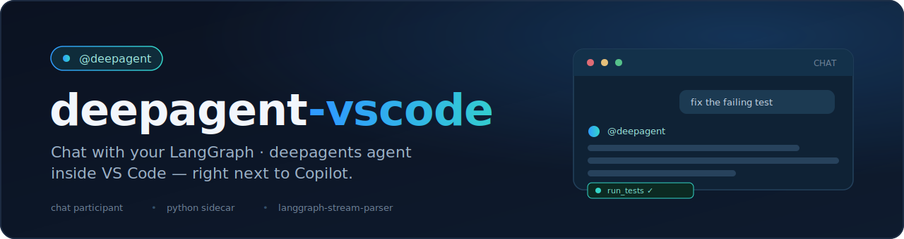

# VS Code — `langstage-vscode`

The VS Code stage: chat with your LangGraph agent inside VS Code — in the same
chat panel as Copilot — via the `@langstage` chat participant.

[:material-github: dkedar7/langstage-vscode](https://github.com/dkedar7/langstage-vscode){ .md-button }
[:material-package: PyPI](https://pypi.org/project/langstage-vscode/){ .md-button }

<figure markdown="span">
  { width="720" }
</figure>

It has two parts in one repo: a TypeScript **extension** that registers the
`@langstage` participant, and a Python **stdio sidecar** (`langstage-vscode`)
that loads your agent and streams its events using the shared
[`langgraph-stream-parser`](../core.md) wire vocabulary.

## Quickstart

```bash
pip install langstage-vscode          # the sidecar
```

```bash
# Run the extension from source (until it's on the Marketplace):
cd extension && npm install && npm run compile
# then press F5 in VS Code to launch an Extension Development Host
```

In the chat panel:

```text
@langstage summarize the failing tests in this repo and propose a fix
```

Drive the sidecar directly for testing — including a keyless demo:

```bash
LANGSTAGE_AGENT_SPEC=./my_agent.py:graph python -m langstage_vscode
python -m langstage_vscode --demo
python -m langstage_vscode --show-config
```

## Configuration

Set `langstage.agentSpec` in VS Code settings, **or** leave it empty and let the
sidecar resolve the family-standard chain (`langstage.toml` /
`LANGSTAGE_AGENT_SPEC`). A project with `[agent] spec = "..."` in its
`langstage.toml` needs no VS Code setting at all.

!!! note "Status: early"
    The extension isn't on the VS Code Marketplace yet (run from source), and
    interactive HITL approval isn't wired into the chat UI yet (the sidecar
    already supports the round-trip). A real in-editor screenshot is a planned
    follow-up.
