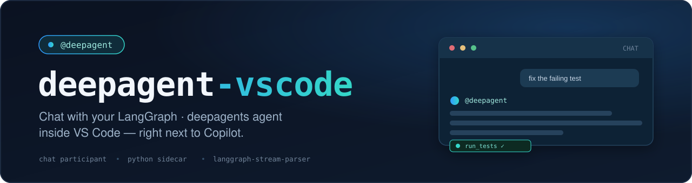

# VS Code — `langstage-vscode`

The VS Code stage: chat with your LangGraph agent inside VS Code, in the same chat
panel as Copilot, through the `@langstage` chat participant.

[:material-github: dkedar7/langstage-vscode](https://github.com/dkedar7/langstage-vscode){ .md-button }
[:material-package: PyPI](https://pypi.org/project/langstage-vscode/){ .md-button }

<figure markdown="span">
  { width="720" }
</figure>

It has two parts: a TypeScript **extension** that registers `@langstage` and
renders the agent's output in the chat view, and a Python **stdio sidecar**
(`langstage-vscode`) that loads your agent and streams its turns through the
shared [`langstage-core`](../core.md) AG-UI bridge.

## Install

1. **The sidecar**, into the Python environment that can import your agent:

    ```bash
    pip install langstage-vscode
    ```

2. **The extension.** It isn't on the Marketplace yet. Every CI run builds an
   installable `.vsix`: open the latest
   [CI run on `main`](https://github.com/dkedar7/langstage-vscode/actions/workflows/ci.yml?query=branch%3Amain),
   download the **`langstage-vscode-vsix`** artifact, unzip it, and install it (VS
   Code 1.95 or newer):

    ```bash
    code --install-extension langstage-vscode-<version>.vsix
    ```

    Or build it yourself from a clone of the repo:

    ```bash
    git clone https://github.com/dkedar7/langstage-vscode
    cd langstage-vscode/extension
    npm install
    npm run package        # writes langstage-vscode-<version>.vsix
    ```

3. **Point it at your agent** (next section), open the chat panel, and start a
   message with `@langstage`:

    ```text
    @langstage summarize the failing tests in this repo and propose a fix
    ```

The response streams the agent's text, tool calls and reasoning. A `write_todos`
call (the deepagents planning tool) renders as a **Tasks** checklist.

## Demo

<!-- TODO(demo): embed the animated VS Code demo here (an @langstage turn with a tool call, then an interrupt answered with the Approve button). -->

## Configuration

| Setting | What it is | Default |
|---|---|---|
| `langstage.agentSpec` | Your agent, as `path/to/agent.py:graph` or `module:graph`. | falls back to `LANGSTAGE_AGENT_SPEC` / `langstage.toml` |
| `langstage.pythonPath` | The Python interpreter that has `langstage-vscode` installed. | `python` |

Leave `langstage.agentSpec` empty and the sidecar resolves the family chain, so a
project with `[agent] spec = "my_agent.py:graph"` in its `langstage.toml` needs no
VS Code setting at all. A `[configurable]` table is forwarded to your graph's
`config["configurable"]` on every turn. Check what resolved with:

```bash
langstage-vscode-sidecar --show-config        # add --json for JSON
```

## Answering an interrupt

When the agent pauses on a human-in-the-loop interrupt, the response shows each
action it wants to take (name, description, arguments) and a button for each
decision the interrupt allows:

| Button | Same as typing | Sends |
|---|---|---|
| **Approve** | `@langstage /approve` | `{"type": "approve"}` |
| **Reject** | `@langstage /reject [reason]` | `{"type": "reject"}`, plus `"message"` if you give a reason |
| **Respond…** | `@langstage /respond <text>` | `{"type": "respond", "message": "<text>"}` |
| **Edit…** | `@langstage /edit <json>` | the JSON merged into `{"type": "edit"}`, e.g. `{"edited_action": {"name": "...", "args": {...}}}` |

**Approve** and **Reject** send immediately. **Respond…** and **Edit…** put the
command in the chat input for you to finish. The resumed turn streams into the chat
like any other reply.

- Only the verbs in the interrupt's `allowed_decisions` get a button, and a command
  for any other verb is refused before it's sent. The sidecar checks every
  decision again with core's `normalize_decision`.
- An interrupt about several actions gets the same decision for each.
- While the agent is paused, a plain message isn't sent (it couldn't reach the
  agent); the buttons are shown again instead.
- The pending interrupt lives in the sidecar process. If it restarts before you
  answer (a settings change, a window reload), the decision is refused with
  `no interrupt pending`; start a new message.

See [Human-in-the-loop](../guides/human-in-the-loop.md) for the verbs and aliases.

## Conversations and memory

Each chat conversation gets its own session id (and so its own LangGraph thread),
minted on its first turn. The extension keeps **one sidecar process per
conversation** alive, so your agent remembers earlier turns even without a
checkpointer of its own: the sidecar attaches an in-memory one. Two conversations
never share a thread.

That memory lives in the process. It's lost when the sidecar restarts (a config
change, a new chat, a reload). For memory that survives restarts, compile your
graph with a persistent checkpointer (`SqliteSaver`, `PostgresSaver`, …).

## Drive the sidecar from a terminal

The sidecar command is `langstage-vscode-sidecar` (also `python -m langstage_vscode`).
It's how you check an agent before wiring up the chat:

```bash
langstage-vscode-sidecar --selfcheck                         # runtime healthy? (uses the demo stub if no agent)
langstage-vscode-sidecar --selfcheck --agent ./my.py:graph   # your agent drives one turn?
langstage-vscode-sidecar --demo --message "hello"            # one turn, print the reply
langstage-vscode-sidecar --demo=tools --message "ask me first"   # pauses on an interrupt: exit 2
langstage-vscode-sidecar --demo=tools --repl                 # multi-turn; answer interrupts inline
```

- **`--selfcheck`** (alias `--smoke`) loads the agent, checks it's a runnable
  graph, and drives one turn. `0` healthy, `2` the turn paused on an interrupt
  (`PAUSED:`), `1` failed, `64` bad arguments (see [Exit codes](../reference/exit-codes.md)). `--json` gives a machine-readable verdict. With no agent
  configured, a pass says it validated only the demo stub.
- **`--message TEXT`** runs one turn and prints the reply (`--json` for the raw
  frames). `0` reply, `2` paused, `1` error. A pause prints the pending action and
  its allowed verbs on stderr.
- **`--repl`** keeps one session across lines, so you can check memory ("my name is
  Kedar", then "what is my name?"). When a turn pauses, the next line is a decision:
  `:decision <verb>` or just the verb (`approve`, `reject [<text>]`,
  `respond <text>`, `edit <json>`). An invalid line is refused and re-prompted.
  `:quit` or Ctrl-D exits.
- **`--demo=tools`** is the keyless rich demo. Its trigger phrases are
  `use a tool`, `think` and `ask me`; anything else is echoed.
- **`--traceback`** (or `LANGSTAGE_DEBUG=1`) shows where your agent crashed.
- **`--version`** names the runtime, e.g. `langstage-vscode-sidecar 0.5.33
  (langstage-core 1.0.38, ag-ui-langgraph 0.0.45)`.

## Sidecar protocol

The extension talks to the sidecar in newline-delimited JSON over stdio. You only
need this if you're writing another client.

**Commands** (client → sidecar), one object per line:

```json
{"type": "message",  "session_id": "s1", "content": "hello"}
{"type": "decision", "session_id": "s1", "decisions": [{"type": "approve"}]}
{"type": "cancel",   "session_id": "s1"}
{"type": "shutdown"}
```

**Events** (sidecar → client) are the core's event-wire frames (see the
[frame reference](../reference/frames.md)) plus protocol frames:

| Frame | When |
|---|---|
| `{"type": "ready"}` | Once, at startup. A startup failure is a single `error` frame with no `ready`, then exit `1`. |
| `{"type": "ack", "ref": "message"}` | A command was accepted (`"ref": "decision"` for a decision). |
| `{"type": "cancelled", "session_id": …}` | A `cancel` stopped the turn. Neither `complete` nor `error`. |
| `{"type": "turn_end", "session_id": …}` | Every `message` and `decision` ends with this, even a rejected one. |

- A `decision` whose verb is missing or not in `allowed_decisions` gets
  `error → turn_end` with no `ack`, and the interrupt stays pending. The legacy
  aliases `accept`, `ignore` and `response` are accepted.
- A `message` sent while the session is paused on an interrupt is refused the same
  way: answer with a `decision`.
- `cancel` stops the turn cooperatively and keeps the session and its memory. The
  cancelled prompt is rolled back out of the history (when the checkpointer can be
  read synchronously, as the default in-memory one can).
- Commands are read as UTF-8 whatever the system locale.
- Wait for `turn_end`, not `complete`: an agent error ends `error → turn_end`, and a
  cancelled turn ends `cancelled → turn_end`.
