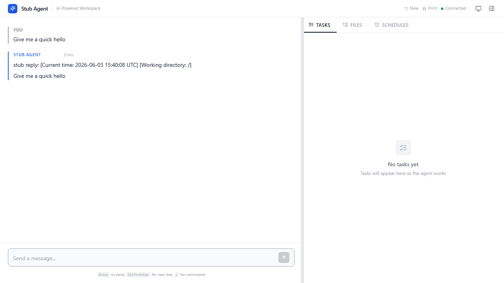
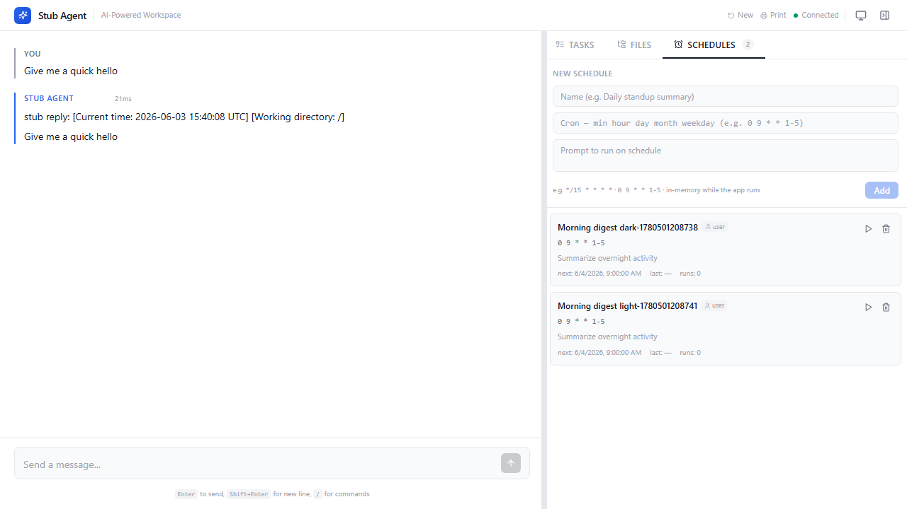
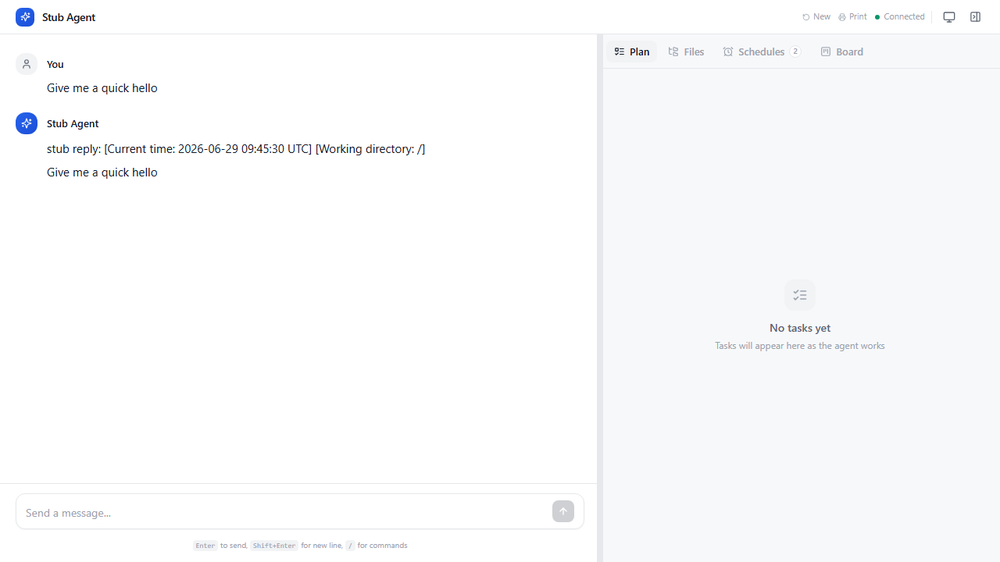
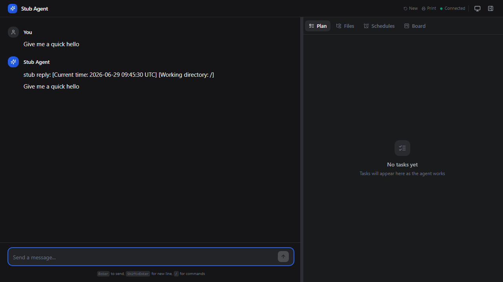

# Web — `langstage`

The web stage: a chat workspace for your LangGraph agent with real-time
streaming, a workspace file browser, scheduled runs, and a canvas for
visualizations. React frontend, FastAPI backend.

[:material-github: dkedar7/langstage](https://github.com/dkedar7/langstage){ .md-button }
[:material-package: PyPI](https://pypi.org/project/langstage/){ .md-button }

## Quickstart

```bash
pip install langstage
langstage run --demo                              # keyless echo agent
langstage run --agent my_agent.py:graph           # your agent
langstage run --agent my_agent.py:graph --port 8080 --theme dark --title "My Agent"
```

From Python:

```python
from langstage import CoworkApp

app = CoworkApp(
    agent=your_langgraph_agent,   # any LangGraph CompiledGraph
    workspace="./workspace",
    title="My Agent",
)
app.run()
```

## What it looks like

<figure markdown="span">
  { width="720" }
  <figcaption>Streaming chat with inline tool calls.</figcaption>
</figure>

=== "Schedules"

    <figure markdown="span">
      { width="720" }
      <figcaption>Recurring agent runs on a cron schedule.</figcaption>
    </figure>

=== "Plan"

    <figure markdown="span">
      { width="720" }
      <figcaption>Live to-do list synced from the agent's <code>write_todos</code> calls.</figcaption>
    </figure>

=== "Dark theme"

    <figure markdown="span">
      { width="720" }
    </figure>

## Highlights

- **Streaming chat** with inline tool-call visualization (args, results,
  duration, status).
- **Starter prompts** — one-click suggestion chips on the empty state to get
  going fast.
- **Rich inline content** — HTML, Plotly, images, DataFrames, PDFs, JSON.
- **Canvas panel** — a persistent report surface; opt in by attaching
  `CanvasMiddleware` to your agent.
- **File browser**, **task tracking**, **human-in-the-loop** approval dialogs.
- **Scheduled runs** on cron expressions — with one-click presets for common
  cadences (hourly, daily, weekdays) so you don't have to write raw cron.
- **Theming** (light/dark/auto), optional HTTP Basic Auth, custom branding.

See [Configuration](../getting-started/configuration.md) for the full set of
flags, env vars, and `langstage.toml` keys.
