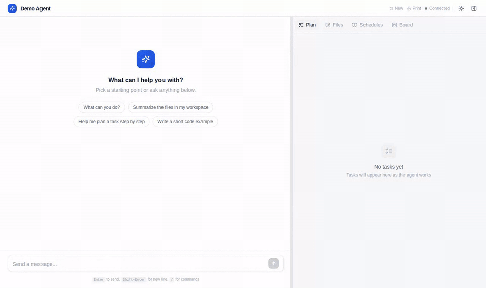
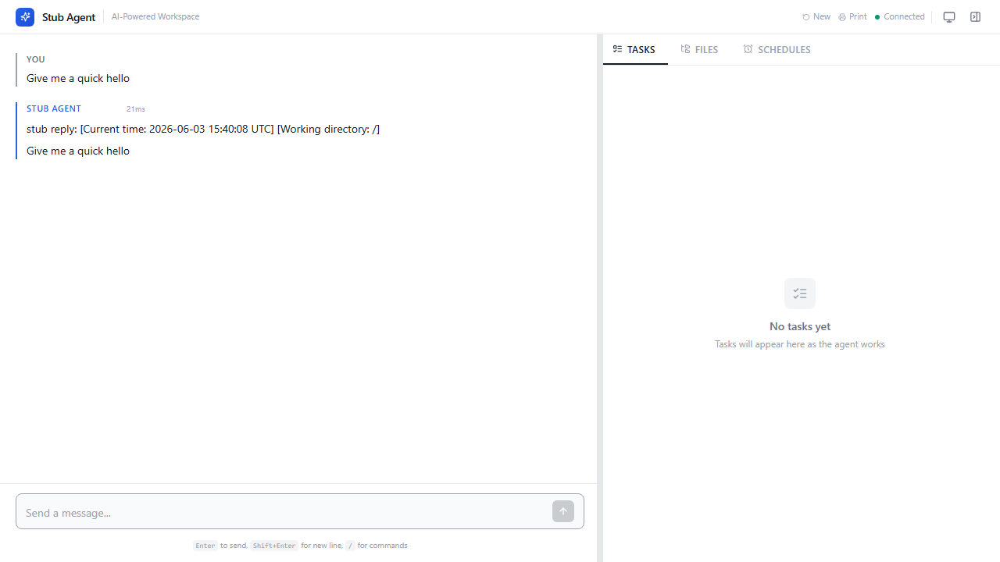
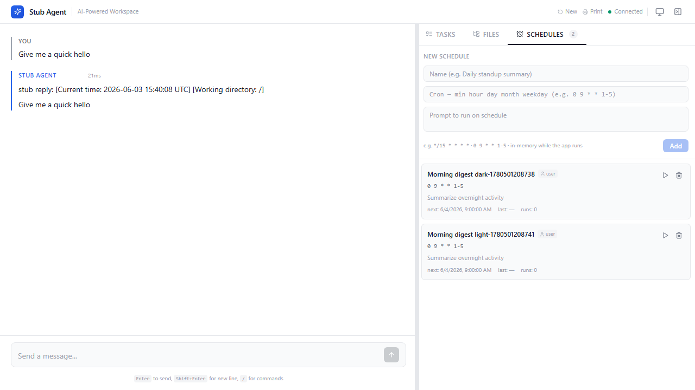
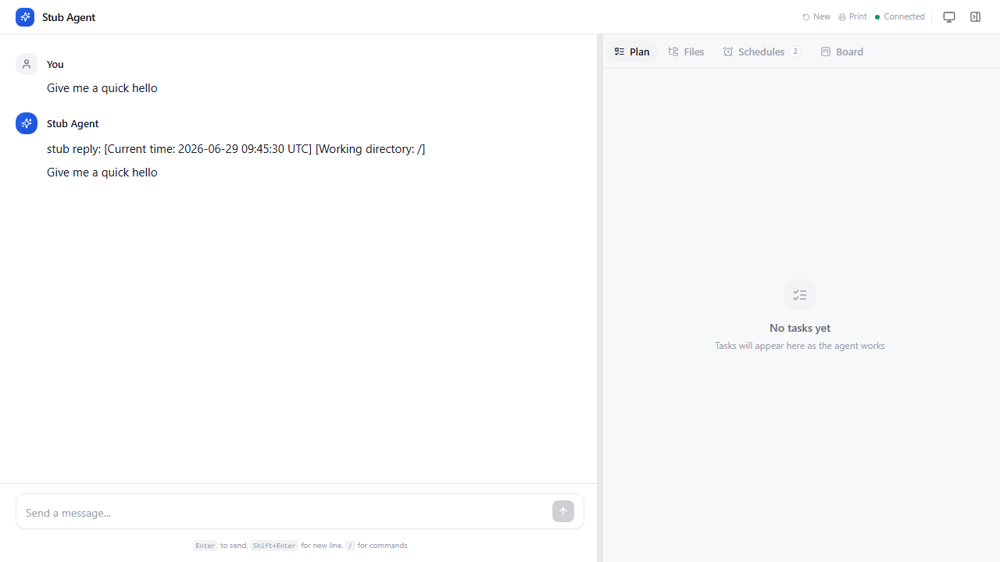
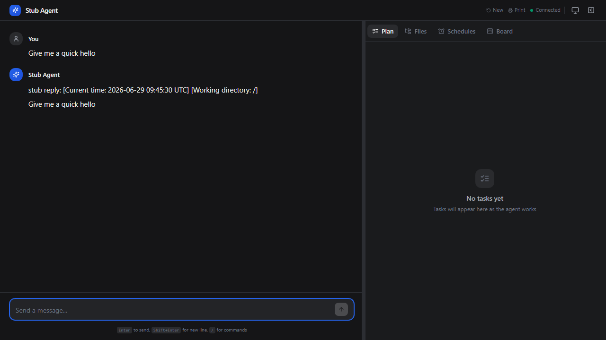

# Web — `langstage`

The web stage: a chat workspace for your LangGraph agent with real-time streaming,
a workspace file browser, a task board for background work, scheduled runs, and a
canvas for reports. React frontend, FastAPI backend.

[:material-github: dkedar7/langstage](https://github.com/dkedar7/langstage){ .md-button }
[:material-package: PyPI](https://pypi.org/project/langstage/){ .md-button }

## Quickstart

<!-- snippet: run server needs=my_agent.py -->
```bash
pip install langstage
langstage run --demo                              # keyless echo agent
langstage run --agent my_agent.py:graph           # your agent
langstage run --agent my_agent.py:graph --port 8080 --theme dark --title "My Agent"
```

With no `--agent` and no configured spec, `langstage run` uses a built-in default
agent, which needs `pip install "langstage[deepagents]"` and `ANTHROPIC_API_KEY`.

From Python:

<!-- snippet: check -->
```python
from langstage import CoworkApp

app = CoworkApp(
    agent=your_langgraph_agent,   # any LangGraph CompiledGraph
    workspace="./workspace",
    title="My Agent",
)
app.run()
```

`run_app(agent=..., workspace=...)` is the one-line shorthand. In a Jupyter notebook
the same `app.run()` serves on a background thread and returns a handle right away,
so the kernel stays usable; call `server.stop()` when you're done. In a notebook the
kernel's working directory is left alone. In a script or from the CLI, `run()` makes
the workspace the process's working directory, so your agent's relative file writes
land where the file browser shows them.

## Demo

<figure markdown="span">
  { width="760" loading="lazy" }
  <figcaption>The keyless tool demo agent (<code>langstage run -a langstage_core.demo.tools:graph</code>): a tool call, a reasoning turn, the file browser, and a background task on the Board.</figcaption>
</figure>

## What it looks like

<figure markdown="span">
  { width="720" }
  <figcaption>Streaming chat with inline tool calls.</figcaption>
</figure>

=== "Schedules"

    <figure markdown="span">
      { width="720" }
      <figcaption>Recurring agent runs on a cron schedule.</figcaption>
    </figure>

=== "Plan"

    <figure markdown="span">
      { width="720" }
      <figcaption>Live to-do list synced from the agent's <code>write_todos</code> calls.</figcaption>
    </figure>

=== "Dark theme"

    <figure markdown="span">
      { width="720" }
    </figure>

## Highlights

- **Streaming chat** with inline tool calls (arguments, results, duration, status).
- **Starter prompts**: one-click suggestion chips on the empty screen.
- **Rich inline content**: HTML, Plotly, images, DataFrames, PDFs, JSON.
- **Canvas panel**, a persistent report surface. Opt in by attaching
  `CanvasMiddleware` to your agent.
- **File browser** with a syntax-highlighted viewer and live change detection.
- **Task board** for background work, and **schedules** on cron.
- **Human-in-the-loop** approval dialogs. See [Human-in-the-loop](../guides/human-in-the-loop.md).
- **Slash commands**: `/save-workflow`, `/create-workflow`, `/run-workflow`.
- **Theming** (light, dark, auto, or your own CSS), optional HTTP Basic Auth, custom
  branding.

## Bring your own agent

Point `--agent` at any compiled LangGraph graph. Chat, tool calls, the file browser,
the task board and schedules work immediately. A few features light up when your
agent follows a convention:

| Feature | How to unlock it |
|---|---|
| **Plan** tab | The agent calls `write_todos` (the deepagents convention). |
| **Rich inline content** | A tool returns the `display_inline` shape. |
| **Canvas** tab | Attach `langstage.middleware.CanvasMiddleware`. |
| **Agent self-delegation and agent-created schedules** | Add the host tools: `from langstage import LANGSTAGE_TOOLS`, then `tools=[*my_tools, *LANGSTAGE_TOOLS]`. |
| **Human-in-the-loop review** | LangGraph `interrupt()`, or deepagents' `interrupt_on=...`. |

**Checkpointer.** If your graph has none, LangStage attaches one, and at server
start it is a durable SQLite saver at `<workspace>/.langstage/checkpoints.db`. So
conversation memory, interrupts and the task review gate work, and survive a
restart. A graph that compiles in its own checkpointer keeps it.

## Command-line tools

<!-- snippet: check -->
```bash
langstage check --agent my_agent.py:graph            # static preflight: loads? what lights up?
langstage check --agent my_agent.py:graph --live     # + one real turn; exit 1 if it errors
langstage check --agent my_agent.py:graph --json | jq -e '.loads and .checks.canvas.ok'
langstage chat --demo "hello"                        # one turn, reply on stdout, no server
langstage config                                     # resolved config (also --json, --strict)
langstage init                                       # a fully commented langstage.toml
```

- Without `--agent`, `check` and `chat` use the configured agent
  (`LANGSTAGE_AGENT_SPEC` or `[agent] spec`), the same one `run` serves.
- `check` prints `[ ok ]` / `[warn]` lines for loading, the checkpointer, Canvas,
  `write_todos` and the host tools. The static checks need no key.
- `chat` adds the same per-message context the browser does (current time and the
  workspace path). Pass `--no-context` for a bare echo in scripts.
- `config --strict` exits `1` if anything in the config was ignored or degraded:
  a malformed `langstage.toml`, a bad value, an unknown key. See
  [Configuration](../getting-started/configuration.md#fail-ci-on-a-config-problem).

## Task board

The **Board** tab delegates work to background copies of your agent while you keep
chatting. There is no extra infrastructure: tasks live in a local SQLite file
(`<workspace>/.langstage/tasks.db`, so the board survives a restart) and run on an
in-process worker pool built on the core [task engine](../core.md#delegate-work-to-a-background-task).

- A task moves `queued → ongoing → review → done`. Cancel or retry from any card.
- Click a card to live-tail the agent's full stream, approve or reject a task
  paused for review, or send a follow-up.
- The default agent can delegate to itself with five tools (`start_async_task`,
  `check_async_task`, `list_async_tasks`, `update_async_task`,
  `cancel_async_task`). Give a custom agent the same with `LANGSTAGE_TOOLS` (or
  `langstage_core.tasks.TASK_TOOLS` for just the task tools). Spawned tasks link
  to their parent on the board.
- Concurrency is `LANGSTAGE_TASK_CONCURRENCY` (default 3).
- Every task runs the agent the server started with. `POST /api/tasks` rejects a
  non-null `agent_spec` with 422 rather than load another module over HTTP.

!!! warning "Run one server process"
    The task claim and the worker pool are scoped to one process. Multiple uvicorn
    workers would run tasks twice.

## Schedules

The **Schedules** tab runs a prompt on a cron expression, with presets for common
cadences. Each fire enqueues a task on the board.

- **Schedules persist.** They are stored in the same SQLite file as the board and
  reloaded at startup. Fires missed while the server was down are not replayed;
  each schedule resumes at its next time.
- **Cron is UTC.** `0 9 * * *` fires at 09:00 UTC, whatever the host's timezone,
  and the tab shows times in UTC.
- **No overlaps.** If the previous fire's task is still queued, running or
  awaiting review, the next automatic fire is skipped (the row says
  `skipped: previous run still …`). **Run now** bypasses this.
- **Can't be paused.** Delete a schedule and create it again later.
  `POST /api/cron` takes exactly `name`, `cron` and `prompt`; any other field,
  including `enabled`, is rejected with 422.

## REST API and OpenAPI

The backend is FastAPI, so it serves a complete, always-current OpenAPI schema for
the whole REST surface (chat, files, canvas, cron, tasks, health):

| Route | What |
|---|---|
| `/docs` | Swagger UI: try every endpoint. |
| `/redoc` | ReDoc: a readable reference. |
| `/openapi.json` | The raw schema, for client generators. |

Chat streams over server-sent events: `GET /api/stream?session_id=…` plus
`POST /api/chat`. A session with no open stream and no running turn is dropped 60
seconds after its stream closes; reconnecting with the same `session_id` picks the
conversation back up from the checkpointer. Tasks are under `/api/tasks`, schedules
under `/api/cron` (not `/api/schedules`).

**Health.** `GET /api/health` is liveness (always auth-exempt). `GET
/api/health?ready=1` is readiness: 200 only if the agent is a runnable graph and the
task store is reachable, else 503. Use it for reverse proxies, Kubernetes and uptime
monitors.

## Security

- **Auth.** Set `--auth-password` (or `LANGSTAGE_AUTH_PASSWORD`) to put HTTP Basic
  Auth on every route except `/api/health`, including `/docs` and WebSocket
  upgrades.
- **Binding to the network.** The default `localhost` bind is reachable only from
  the same machine. If you bind a non-loopback host (`--host 0.0.0.0`) without a
  password, the whole REST surface, including the file browser's read, write and
  delete, is open to anyone on the network. LangStage prints a warning at startup
  but still starts. The safer option is to keep `localhost` and use an SSH tunnel.
- **Files.** The file routes stay inside the workspace, including through
  symlinks.

### CORS

Browsers on the same machine (`localhost`, `127.0.0.1`, `[::1]` on any port) can
call the server by default, which covers a frontend dev server. To allow other
origins, list them:

<!-- snippet: run server needs=my_agent.py -->
```bash
LANGSTAGE_CORS_ORIGINS="https://app.example.com,https://admin.example.com" langstage run --agent my_agent.py:graph
```

or `[server] cors_origins = ["https://app.example.com"]` in `langstage.toml`. Listed
origins get **credentialed** access (cookies and Basic Auth). `*` allows any
origin, with credentials off. Preflight `OPTIONS` requests are answered before auth,
so this works with `--auth-password` set. `langstage config` shows the resolved
value.

## Configuration

Precedence, highest first: **Python args > CLI flags > `LANGSTAGE_*` env >
project `langstage.toml` > global `~/.langstage/config.toml` > defaults**. See
[Configuration](../getting-started/configuration.md) for how the layers work.

| Option | CLI flag | Env var | Default |
|---|---|---|---|
| Agent spec | `--agent` | `LANGSTAGE_AGENT_SPEC` | built-in default agent (needs `[deepagents]`) |
| Workspace | `--workspace` | `LANGSTAGE_WORKSPACE_ROOT` | `.` |
| Host | `--host` | `LANGSTAGE_HOST` | `localhost` |
| Port | `--port` | `LANGSTAGE_PORT` | `8050` |
| Debug | `--debug` | `LANGSTAGE_DEBUG` | `false` |
| Title | `--title` | `LANGSTAGE_TITLE` | the agent's `.name`, or `LangStage` |
| Subtitle | `--subtitle` | `LANGSTAGE_SUBTITLE` | hidden |
| Welcome message | `--welcome-message` | `LANGSTAGE_WELCOME_MESSAGE` | empty |
| Theme | `--theme` | `LANGSTAGE_THEME` | `auto` |
| Agent name | `--agent-name` | `LANGSTAGE_AGENT_NAME` | the agent's `.name`, or `Agent` |
| Icon URL | `--icon-url` | `LANGSTAGE_ICON_URL` | none |
| Auth username | `--auth-username` | `LANGSTAGE_AUTH_USERNAME` | `admin` |
| Auth password | `--auth-password` | `LANGSTAGE_AUTH_PASSWORD` | none (auth off) |
| Workflow prompts | `--save-workflow-prompt`, `--run-workflow-prompt`, `--create-workflow-prompt` | `LANGSTAGE_SAVE_WORKFLOW_PROMPT`, … | built in |
| Custom CSS | `--custom-css` | `LANGSTAGE_CUSTOM_CSS` | none |
| Canvas tab | `--show-canvas/--no-show-canvas` | `LANGSTAGE_SHOW_CANVAS` | auto (on with `CanvasMiddleware`) |
| Files tab | `--show-files/--no-show-files` | `LANGSTAGE_SHOW_FILES` | on |
| Task concurrency | — | `LANGSTAGE_TASK_CONCURRENCY` | `3` |
| CORS origins | — | `LANGSTAGE_CORS_ORIGINS` | loopback only |
| `execute_python` memory (MB, default agent) | — | `LANGSTAGE_CELL_MEMORY_LIMIT_MB` | `512` |

`langstage init` writes every option into a commented `langstage.toml` with its
section and env var, so you never have to guess the nesting.

**Custom CSS.** The theme is CSS custom properties, so you can restyle it with a
small file:

<!-- snippet: skip file=theme.css -->
```css title="theme.css"
:root { --color-primary: #0077b6; --color-surface: #f8fbff; }
.dark { --color-surface: #0a1628; }
```

<!-- snippet: run server -->
```bash
langstage run --demo --custom-css ./theme.css
```
